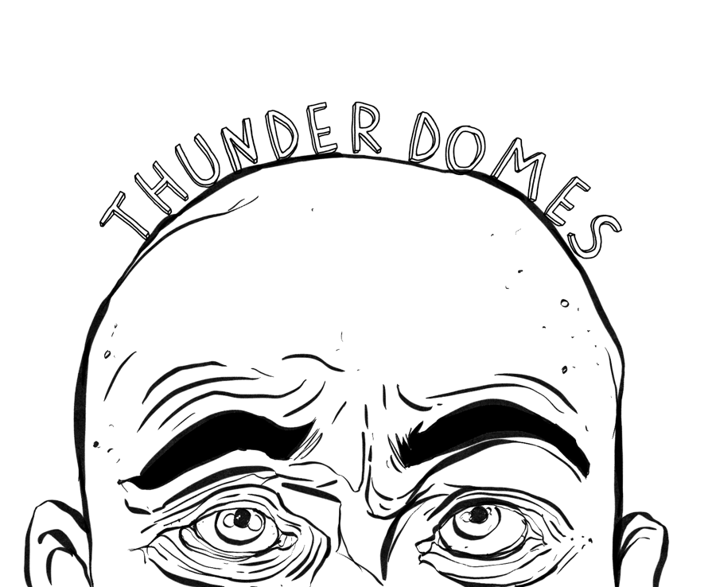

# PERSPEKTIV

Get to know the beautifully weird city of Richmond through its murals and food via a web application integrating multiple server-side APIs to display information about the city's art and food scenes.

https://markdcross.github.io/perspektiv/

## User Story
It's a beautiful day and you want to explore RVA and appreciate what the city has to offer. We have developed an app to help easily explore and learn about this amazingly quirky city.
``` 
AS a Richmonder and art enthusiast 
I am proud of my city and appreciate its creativity and artistic expression
I WANT to explore my city through its local art
AND discover new art and food along the way
SO I can learn and appreciate Richmond culture
```

## Technology

### APIs and Libraries
-   jQuery
-   Nominatum 
-   OpenStreetMap
-   Mapbox
-   Leaflet
-   Yelp
-   City of Richmond Open Data Portal

## Functionality
```
GIVEN a gallery view of RVA murals
WHEN I click on an image
THEN the image expands and focuses in via a lightbox
WHEN I click on the pin in the top left corner of a mural
THEN I'm taken to the map view with the selected mural identified
WHEN I click or hover over the small markers on the map
THEN I am presented with additional location information
WHEN I click on the image of the mural in the map view
THEN I'm presented with the artist information
WHEN I select the "Around the corner" tab
THEN I'm presented with images, links, category, and address of nearby food and beverage establishments
WHEN I select a new map marker 
THEN that mural information populates
SO that I can easily establish a plan for the day
```

## Future Dev

### API Enhancements

**Resolve CORS issues and remove proxy to improve stability and performance**

This is likely best served by replacing the Yelp API outright. This will allow us to utilize an API that doesn't have CORS conflicts, but also one that is more more community friendly (allowing us to access the restaurant's information directly, instead of linking to the Yelp database, for example). Zomato is currently the leading option.

### Improved community

**Establish profiles for artists**

Allowing artists to set up a portfolio adds a new level of depth and engagement to Perspektiv. Providing an opportunity to communcate, further share their creations, and develop their personal brand increases the "stickiness" of the app as well as its benefit to the community. This also introduces the idea of a self-clensing database of mural and artist information. 

**Establish profiles for businesses**

Similarly, Allowing local businesses to set up profiles gives them better control of how their business is percieved and engaged with, further engaging the user and providing additional userfulness. 

### Additional functionality

In addition to the above data and stability enhancements, there are a number of additional features that we would like to include moving forward. Further refining our local storage to include the ability to track a user's scroll through the gallery view and save their place and establishing a "favorites" list of murals. We would also like to continue to enhance the user experience by introducing a pin drop animation and highlighting the current mural location on the map.

# Brought to you by
- [Danny Fraley](https://github.com/dannyfraley "Visit Danny's GitHub")
- [Roberto Rubet](https://github.com/Bertodemus "Visit Berto's GitHub")
- [Javonte Tuppince](https://github.com/Tuppince24 "Visit Javonte's GitHub")
- [Mark Cross](https://github.com/markdcross "Visit Mark's GitHub")


# License
MIT License

Copyright (c) 2020 Mark Cross, Danny Fraley, Javonte Tuppince, Roberto Rubet

Permission is hereby granted, free of charge, to any person obtaining a copy
of this software and associated documentation files (the "Software"), to deal
in the Software without restriction, including without limitation the rights
to use, copy, modify, merge, publish, distribute, sublicense, and/or sell
copies of the Software, and to permit persons to whom the Software is
furnished to do so, subject to the following conditions:

The above copyright notice and this permission notice shall be included in all
copies or substantial portions of the Software.

THE SOFTWARE IS PROVIDED "AS IS", WITHOUT WARRANTY OF ANY KIND, EXPRESS OR
IMPLIED, INCLUDING BUT NOT LIMITED TO THE WARRANTIES OF MERCHANTABILITY,
FITNESS FOR A PARTICULAR PURPOSE AND NONINFRINGEMENT. IN NO EVENT SHALL THE
AUTHORS OR COPYRIGHT HOLDERS BE LIABLE FOR ANY CLAIM, DAMAGES OR OTHER
LIABILITY, WHETHER IN AN ACTION OF CONTRACT, TORT OR OTHERWISE, ARISING FROM,
OUT OF OR IN CONNECTION WITH THE SOFTWARE OR THE USE OR OTHER DEALINGS IN THE
SOFTWARE.
